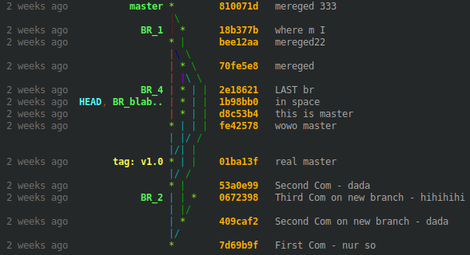

# **Git là gì**

Git là một hệ thống kiểm soát giúp quản lý mã nguồn trong các dự án phần mềm. Cơ bản, Git bao gồm ba vùng chính:

### 1. **Working Directory**:
   - Chứa các file mới hoặc file có thay đổi.

### 2. **Staging Area**:
   - Chứa các file đưa vào chuẩn bị commit (để tạo ra các phiên bản).

### 3. **Repository**:
   - Chứa các commits (hay là các phiên bản của mã nguồn).

---

### **Một số khái niệm trong Git**:
- **Repository (Repo)**: Là nơi lưu trữ các file và lịch sử thay đổi của chúng. Có thể là một repo cục bộ (local repository) trên máy tính và một repo từ xa (remote repository) trên dịch vụ như GitHub.
  
- **Commit**: Một snapshot của mã nguồn tại một thời điểm nhất định, chứa thông tin về thay đổi đã thực hiện.

- **Branch**: Một dòng phát triển riêng biệt trong Git, giúp phát triển tính năng mới mà không ảnh hưởng đến nhánh chính (master).

- **Merge**: Hợp nhất hai nhánh lại với nhau.

- **Clone**: Sao chép một repository từ GitHub về máy.

---

### **Mục tiêu của Git**:
- **Theo dõi và quản lý lịch sử các versions**.
- **Giúp làm việc giữa nhiều người**:
   - Phân nhánh để phát triển đồng thời.
   - Đồng bộ mã nguồn giữa các máy tính.

---

### **Các thao tác cơ bản với Git**:

- `git init`: Khởi tạo một repository Git mới.
  
- `git clone <url>`: Sao chép một repository từ xa về máy tính của bạn.
  
- `git status`: Kiểm tra trạng thái của repository (thêm, thay đổi hay xóa file nào).
  
- `git add .`: Thêm tất cả các file vào staging area (khu vực chuẩn bị commit).
  
- `git add <file>`: Thêm file vào staging area (khu vực chuẩn bị commit).
  
- `git commit -m "message"`: Ghi lại các thay đổi vào lịch sử của repo.
  
- `git commit --amend -m "New commit message"`: Sửa commit gần nhất. Không nên sử dụng lệnh này nếu commit đã được push lên remote repository vì nó có thể gây conflict khi đồng bộ với người khác.

---

### **Xem lịch sử commit**:

- `git log`: Xem lịch sử các commit.

- `git log --oneline`: Hiển thị mỗi commit trên một dòng.

- `git log --graph`: Hiển thị biểu đồ nhánh.
    
    
- `git log --author=<user.name>`: Filter các commit theo tên tác giả.

---

### **Khôi phục thay đổi**:

- `git restore <file_name>`: Khôi phục một file về trạng thái của commit cuối.

- `git restore`: Khôi phục toàn bộ file về trạng thái của commit cuối.

- `git restore --staged <file_name>`: Khôi phục file từ vùng Staging về Working Directory.

---

### **Hủy commit cuối**:

- `git reset HEAD~1`: Hủy bỏ commit nhưng giữ lại các thay đổi trong working directory.

- `git reset --soft HEAD~1`: Chỉ thay đổi HEAD về commit trước và giữ lại các thay đổi trong staging area.

- `git reset --hard HEAD~1`: Không chỉ thay đổi HEAD về commit trước, mà còn loại bỏ tất cả các thay đổi trong working directory và staging area.

---

### **Quản lý nhánh (Branching and Merging)**:

- `git branch <branch_name>`: Tạo một nhánh mới.

- `git checkout <branch>`: Chuyển sang nhánh khác.

- `git checkout -b <branch_name>`: Tạo nhánh mới và chuyển sang nhánh mới.

- `git merge <branch>`: Hợp nhất nhánh vào nhánh hiện tại.

- `git rebase`: Di chuyển hoặc tái cấu trúc các commit, dùng khi muốn tái tạo lịch sử của các nhánh để dễ dàng hợp nhất hơn.

- `git pull <remote_name> <branch_name>`: Tải các thay đổi từ remote repository về máy của bạn.

- `git push`: Đẩy các thay đổi từ local repository lên remote repository.

- `git fetch`: Tải các thay đổi từ remote về mà không áp dụng chúng vào nhánh hiện tại.

---
### Git Workflow for QA Automation

#### Typical Workflow

1. **Clone repository**: `git clone <url>`.
2. **Create feature branch**: `git checkout -b feature/add-login-tests`.
3. **Write/edit test scripts**: Sửa hoặc thêm test scripts.
4. **Stage and commit**:
   - `git add .`
   - `git commit -m "Add login test scripts"`.
5. **Push to remote**: `git push origin feature/add-login-tests`.
6. **Create Pull Request**: Tạo PR trên GitHub/GitLab để yêu cầu merge.
7. **Resolve conflicts (if any)**: Kéo code từ main (`git pull origin main`), giải quyết conflict, đẩy lại.
8. **Merge and delete branch**: Sau khi PR được phê duyệt, xóa nhánh.

---
### 5. Git Convention

Dưới đây là các quy ước phổ biến mà QE automation test nên tuân theo:

#### Branch Naming

- Sử dụng tên nhánh rõ ràng, mô tả mục đích của nhánh.
- Cấu trúc: `<type>/<short-description>`.
- Các loại nhánh phổ biến:
  - `feat/`: Thêm tính năng mới (ví dụ: `feat/add-login-tests`).
  - `fix/`: Sửa lỗi (ví dụ: `fix/fix-login-error`).
  - `chore/`: Cập nhật cấu hình, tài liệu (ví dụ: `chore/update-test-config`).
- Quy tắc:
  - Dùng dấu gạch ngang (`-`) thay vì dấu cách hoặc gạch dưới.
  - Tên nhánh ngắn gọn, dưới 30 ký tự nếu có thể.
  - Liên kết với ticket (nếu có): Ví dụ, `feature/TICKET-123-add-payment-tests`.

#### Commit Messages

- Viết thông điệp commit ngắn gọn, rõ ràng, mô tả chính xác thay đổi.
- Cấu trúc: `<type>(<scope>): <description>`.
  - **type**: Loại thay đổi (ví dụ: `feat`, `fix`, `chore`, `docs`, `test`).
  - **scope**: Phần code bị ảnh hưởng (ví dụ: `login`, `payment`, `api`).
  - **description**: Mô tả ngắn gọn (bắt đầu bằng động từ, viết hoa chữ cái đầu).
- Ví dụ:
  - `feat(login): Add test scripts for user authentication`
  - `fix(payment): Resolve null pointer in payment API tests`
  - `chore(config): Update test environment variables`
- Quy tắc:
  - Dùng tiếng Anh (hoặc ngôn ngữ chung của team).
  - Giới hạn dòng đầu tiên dưới 50 ký tự.
  - Nếu cần giải thích chi tiết, thêm mô tả ở các dòng sau (giới hạn 72 ký tự mỗi dòng).

#### Pull Request (PR) Guidelines

- **Tiêu đề PR**: Tóm tắt mục đích, ví dụ: "Add login test scripts for API".
- **Mô tả PR**:
  - Mô tả ngắn gọn thay đổi.
  - Liên kết với ticket (nếu có): Ví dụ, "Closes TICKET-123".
  - Liệt kê các thay đổi chính hoặc test cases liên quan.
- **Checklist**:
  - Đảm bảo code chạy tốt, tests pass.
  - Thêm reviewer (developer hoặc QE khác).
  - Xóa nhánh sau khi merge (nếu không cần thiết).

#### General Rules

- **Commit nhỏ và thường xuyên**: Mỗi commit chỉ nên chứa một thay đổi logic (ví dụ: thêm một test case, sửa một lỗi).
- **Không commit file nhạy cảm**: Tránh commit file chứa thông tin bí mật (API keys, passwords). Dùng `.gitignore` để loại trừ.
- **Kiểm tra trước khi push**: Chạy tests (`npm test`, `pytest`, v.v.) để đảm bảo code không bị lỗi.
- **Giữ lịch sử sạch**: Sử dụng `git rebase` hoặc `git commit --amend` để sửa commit trước khi push (nếu chưa chia sẻ).

#### Example Workflow with Convention

1. Tạo nhánh: `git checkout -b feat/TICKET-123-add-login-tests`.
2. Viết test scripts và commit:
   - `git add .`
   - `git commit -m "feat(login): Add test scripts for user authentication"`.
3. Push nhánh: `git push origin feat/TICKET-123-add-login-tests`.
4. Tạo PR với tiêu đề: "TICKET-123: Add login test scripts".
5. Sau khi merge, xóa nhánh: `git push origin --delete feat/TICKET-123-add-login-tests`.