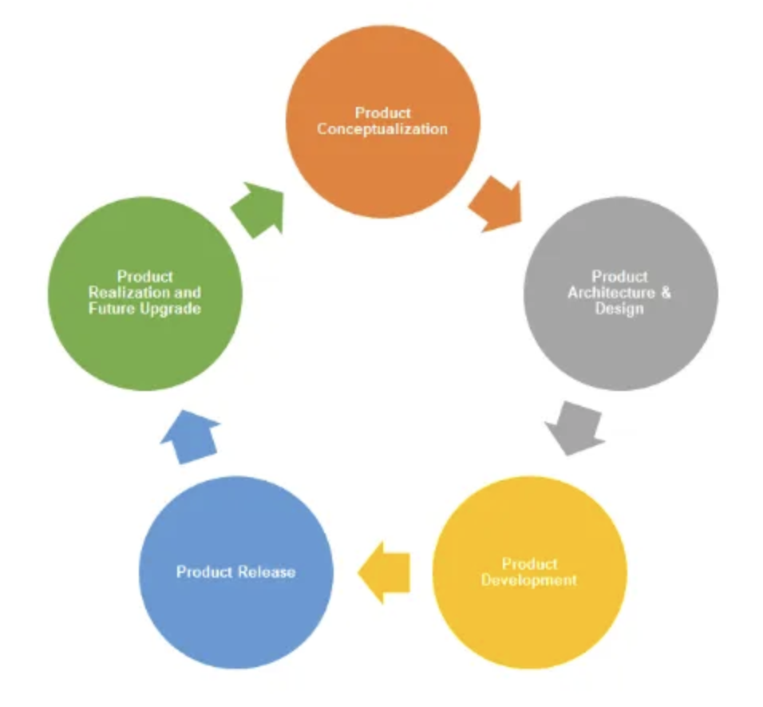

# Vòng đời phát triển sản phẩm (PDLC)

Vòng đời phát triển sản phẩm (PDLC) là toàn bộ quá trình tạo ra và đưa một sản phẩm mới vào thị trường. Nó bao gồm 5 bước sau:

1. **Khái niệm sản phẩm (Product Conceptualization)**
2. **Cấu trúc và thiết kế sản phẩm (Product Architecture and Design)**
3. **Xây dựng và phát triển sản phẩm (Product Construction and Development)**
4. **Đưa sản phẩm ra thị trường (Product Release)**
5. **Hiện thực hóa và nâng cấp trong tương lai (Product Realization and Future Upgrade)**

---

## 1. Khái niệm sản phẩm (Product Conceptualization)

Mỗi sản phẩm đều bắt nguồn từ một ý tưởng. Trong một số trường hợp, nó bắt nguồn từ những lý do rất cơ bản, lên ý tưởng dựa trên những thứ đã có sẵn. Trong những trường hợp khác, việc lên ý tưởng là một sự sáng tạo hoàn toàn mới.

Nhiều công ty công nghệ hàng đầu có bộ phận R&D chuyên để nghiên cứu và đưa ra các "ý tưởng sản phẩm tiếp theo". Sau khi chọn được ý tưởng, họ sẽ nghiên cứu thị trường, phân tích chức năng, kỹ thuật, tính khả thi, ROI và phát triển sản phẩm mẫu.

---

## 2. Cấu trúc và thiết kế sản phẩm (Product Architecture and Design)

Ở giai đoạn này, bộ phận kinh doanh sẽ cung cấp thông tin về thị trường mục tiêu để đội kỹ thuật xây dựng cấu trúc sản phẩm. Họ sẽ tạo sơ đồ quy trình làm việc và thiết kế cơ sở dữ liệu (DB).

---

## 3. Phát triển sản phẩm (Product Development)

Bộ phận phát triển có thể sử dụng phương pháp **Waterfall** hoặc **Agile**, nhưng hầu hết các công ty hiện nay đều chọn **Agile** để tăng tốc quá trình.

Quá trình phát triển bao gồm:
- Kiểm tra từng công đoạn
- Kiểm tra tích hợp
- Kiểm tra hiệu suất

Kết quả là một bản **Alpha**, được thử nghiệm nội bộ hoặc giới hạn người dùng bên ngoài.

---

## 4. Đưa sản phẩm ra thị trường (Product Release)

Sau bản Alpha, sản phẩm sẽ được phát hành dưới dạng **Beta** (có thể mở rộng hoặc giới hạn người dùng). Giai đoạn này quan trọng để lấy phản hồi thực tế từ khách hàng bên ngoài.

Sau khi phản hồi đã được xử lý và sản phẩm đạt yêu cầu, **bản chính thức** sẽ được công bố, thường đi kèm các chiến dịch truyền thông, PR, và quảng bá mạnh mẽ.

---

## 5. Hiện thực hóa sản phẩm và nâng cấp trong tương lai (Product Realization and Future Upgrade)

Sản phẩm sau khi ra mắt cần được:
- Theo dõi liên tục
- Cập nhật dựa trên phản hồi
- Ưu tiên sửa lỗi và nâng cấp trong các phiên bản tiếp theo

---

## Ví dụ minh họa

Các công ty phần mềm thường áp dụng quy trình này khi phát triển một tính năng mới, chẳng hạn như **Import Product**:

- Nghiên cứu thị trường về lý do tại sao cần chức năng Import trong khi đã có Add Product.
- Phân tích tính khả thi công nghệ và hành vi người dùng.
- Làm việc cùng thiết kế để đảm bảo trải nghiệm liền mạch.
- Hoàn thiện sản phẩm dựa trên phản hồi.
- Theo dõi và sửa lỗi sau khi ra mắt chính thức.