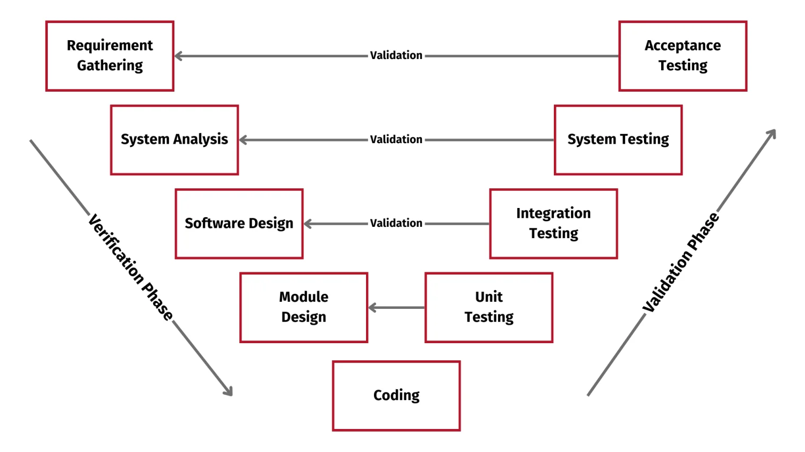
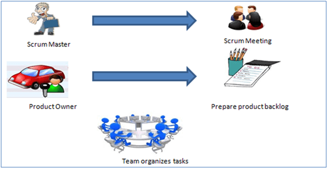
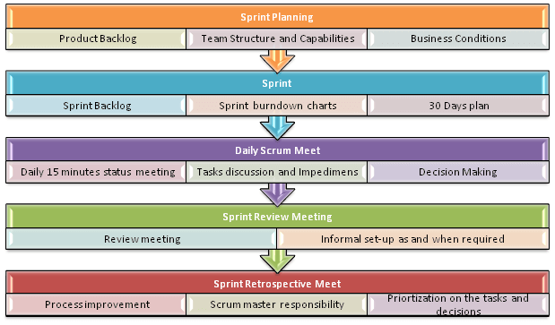

# 1. Waterfall (Mô hình thác nước)

## Khái niệm

Mô hình Waterfall là một phương pháp phát triển phần mềm tuần tự, trong đó các giai đoạn được thực hiện theo thứ tự tuyến tính và chỉ chuyển sang giai đoạn tiếp theo khi giai đoạn hiện tại hoàn tất. Mỗi giai đoạn có đầu ra rõ ràng, đóng vai trò là đầu vào cho giai đoạn tiếp theo.

## Quy trình chi tiết

- **Lập kế hoạch (Planning):** Xác định mục tiêu dự án, phạm vi, ngân sách, nguồn lực, và lịch trình.  
  **Đầu ra:** Tài liệu kế hoạch dự án (Project Plan).

- **Phân tích yêu cầu (Requirement Analysis):** Thu thập, phân tích, và tài liệu hóa yêu cầu từ khách hàng và người dùng.  
  **Đầu ra:** Tài liệu yêu cầu phần mềm (Software Requirement Specification - SRS).

- **Thiết kế hệ thống (System Design):** Tạo kiến trúc phần mềm, thiết kế giao diện, cơ sở dữ liệu, và các thành phần kỹ thuật.  
  **Đầu ra:** Tài liệu thiết kế (Design Document).

- **Phát triển (Implementation/Coding):** Viết mã nguồn dựa trên tài liệu thiết kế.  
  **Đầu ra:** Mã nguồn phần mềm.

- **Kiểm thử (Testing):** Kiểm tra phần mềm để tìm lỗi và đảm bảo đáp ứng yêu cầu.  
  **Đầu ra:** Báo cáo kiểm thử và phần mềm đã sửa lỗi.

- **Triển khai (Deployment):** Đưa phần mềm vào môi trường sản xuất.  
  **Đầu ra:** Phần mềm hoạt động trong môi trường thực tế.

- **Bảo trì (Maintenance):** Sửa lỗi, nâng cấp tính năng dựa trên phản hồi người dùng.  
  **Đầu ra:** Phiên bản phần mềm cập nhật.

## Đặc điểm

- Quy trình tuyến tính, không cho phép quay lại giai đoạn trước.
- Mỗi giai đoạn có tài liệu rõ ràng, dễ theo dõi.
- Phù hợp với các dự án có yêu cầu cố định, ít thay đổi.

## Ưu điểm

- **Dễ quản lý:** Quy trình rõ ràng, dễ theo dõi tiến độ.
- **Tài liệu đầy đủ:** Mỗi giai đoạn tạo ra tài liệu chi tiết, hỗ trợ bảo trì lâu dài.
- **Phù hợp với dự án nhỏ hoặc cố định:** Yêu cầu được xác định rõ từ đầu, ít rủi ro thay đổi.

## Nhược điểm

- **Thiếu linh hoạt:** Khó điều chỉnh khi yêu cầu thay đổi.
- **Phát hiện lỗi muộn:** Lỗi thường chỉ được phát hiện ở giai đoạn kiểm thử, gây tốn kém để sửa.
- **Không phù hợp với dự án phức tạp:** Các dự án lớn với yêu cầu không rõ ràng dễ thất bại.

## Trường hợp áp dụng

- Các dự án có yêu cầu rõ ràng và không thay đổi, như hệ thống quản lý tài chính doanh nghiệp, phần mềm kế toán.
- Các dự án ngắn hạn với phạm vi nhỏ.
- Các dự án trong lĩnh vực yêu cầu độ chính xác cao (như y tế, chính phủ), nơi tài liệu hóa là bắt buộc.

---

# 2. V-model

Trong V-model các hoạt động phát triển và đảm bảo chất lượng được thực hiện đồng thời.

**Kiểm tra trong suốt vòng đời dự án bao gồm:**

- **Xác minh:** Kiểm tra xem sản phẩm có đáp ứng các yêu cầu đã được đề ra cho nó.

  *Ex:* đảm bảo rằng một trang web đang được xây dựng tuân theo các hướng dẫn để làm cho các trang web có thể sử dụng được bởi nhiều người nhất có thể.

- **Xác thực:** Đánh giá sản phẩm so với nhu cầu của người dùng.

  *Ex:* Xác thực sẽ bao gồm những người dùng mới kiểm tra xem họ cũng có thể sử dụng trang web một cách dễ dàng.

### Phía bên tay trái: là hoạt động phát triển

#### Phân tích yêu cầu

- **Xác minh:** Đánh giá yêu cầu (Requirements review).
- **Xác thực:** Tạo test case UAT (User Acceptance Test).
- **Đầu ra:** Tài liệu hiểu về yêu cầu, UAT test case.

#### Yêu cầu hệ thống

- **Xác minh:** Đánh giá thiết kế (Design reviews).
- **Xác thực:** Tạo test plan, test design, test case, automation code (nếu có).
- **Đầu ra:** Test plan, test design, test case, automation code.

#### Thiết kế kiến trúc

- **Xác minh:** Đánh giá thiết kế.
- **Xác thực:** Kế hoạch thử nghiệm tích hợp và các trường hợp thử nghiệm.
- **Đầu ra:** Tài liệu thiết kế, kế hoạch kiểm thử tích hợp, thiết kế bảng cơ sở dữ liệu.

#### Thiết kế module / cấp thấp

- **Xác minh:** Đánh giá thiết kế.
- **Xác thực:** Tạo và xem xét các trường hợp kiểm tra đơn vị.
- **Đầu ra:** Các đơn vị kiểm tra đơn vị.

#### Code

- **Xác minh:** Xem xét mã, kiểm tra các trường hợp kiểm tra.
- **Xác thực:** Tạo các trường hợp kiểm tra chức năng.
- **Đầu ra:** Các trường hợp thử nghiệm, danh sách kiểm tra xem lại.

### Phía bên tay phải: là hoạt động kiểm thử (Xác nhận)

- **Kiểm tra đơn vị (Unit Test)**
- **Kiểm tra tích hợp (Integration Testing)**
- **Kiểm tra hệ thống (System Testing)**
- **Thử nghiệm chấp nhận của người dùng (User Acceptance Test - UAT)**

### V-model được sử dụng khi:

- Yêu cầu được xác định rõ ràng và không mơ hồ.
- Tiêu chí chấp nhận được xác định rõ ràng.
- Dự án có quy mô vừa và nhỏ.
- Công nghệ và công cụ được sử dụng không thường xuyên thay đổi.

### Ưu điểm

- Quá trình phát triển và quy trình quản lý có tính tổ chức và hệ thống.
- Hoạt động tốt cho các dự án vừa và nhỏ.
- Kiểm tra bắt đầu từ đầu, giảm sự mơ hồ.
- Dễ quản lý với mục tiêu rõ ràng.

### Nhược điểm

- Không thích hợp cho dự án lớn/phức tạp.
- Không phù hợp khi yêu cầu thay đổi liên tục.
- Không có phần mềm làm việc ở giai đoạn trung gian.
- Không phân tích rủi ro, có tính không chắc chắn.

---

# 3. Agile

Agile là một phương pháp thúc đẩy sự lặp lại liên tục của quá trình phát triển và kiểm thử trong suốt vòng đời phát triển phần mềm.

## 4 giá trị cốt lõi

1. Tương tác cá nhân và theo nhóm hơn là các quy trình và công cụ
2. Phần mềm có thể làm việc hơn là tài liệu đầy đủ
3. Sự hợp tác của khách hàng hơn là quá trình đàm phán hợp đồng
4. Đáp ứng với thay đổi hơn là tuân thủ kế hoạch

## So sánh Agile vs Waterfall

| Tiêu chí | Agile | Waterfall |
|---------|-------|-----------|
| Cách tiếp cận | Lặp lại & tăng dần | Tuyến tính |
| Thiết kế | Chia mô-đun nhỏ | Không chia mô-đun |
| Khách hàng | Tham gia xuyên suốt | Chỉ xem cuối |
| Linh hoạt | Cao | Thấp |
| Ước lượng thời gian | Khó với dự án lớn | Chính xác |
| Sửa lỗi | Mọi lúc | Cuối mới sửa |
| Tài liệu | Không ưu tiên | Ưu tiên hàng đầu |
| Kiểm thử | Trong mỗi vòng lặp | Sau phát triển |
| Giao sản phẩm | Từng phần | Tất cả sau triển khai |
| Dev & Tester | Làm việc chung | Làm riêng |
| Giao tiếp | Chặt chẽ | Thưa thớt |

---

# Scrum

SCRUM là phương pháp Agile quản lý nhiệm vụ trong nhóm nhỏ (7-9 thành viên).

## 3 vai trò chính:

- **Development Team:** Tự quản và tổ chức công việc
- **Scrum Master:** Tổ chức Sprint, loại bỏ trở ngại
- **Product Owner:** Tạo & ưu tiên backlog, giao chức năng

## Các thực hành Scrum:

- **Sprint Planning:** Lên kế hoạch từ Product Backlog
- **Sprint:** Vòng lặp phát triển 2–4 tuần
- **Daily Meeting:** Họp ngắn hằng ngày (~15 phút)
- **Review Meeting:** Trình bày tính năng hoàn thành
- **Retrospective Meeting:** Rút kinh nghiệm cuối sprint

## Quy trình Scrum:

1. Sprint lặp lại liên tục
2. Product Backlog chứa yêu cầu
3. User Story -> Sprint Backlog
4. Team làm việc theo Sprint Backlog
5. Daily check công việc
6. Cuối Sprint: Bàn giao sản phẩm
