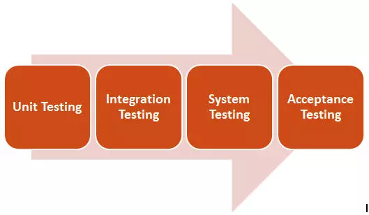
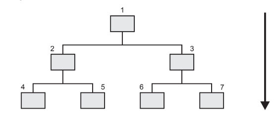
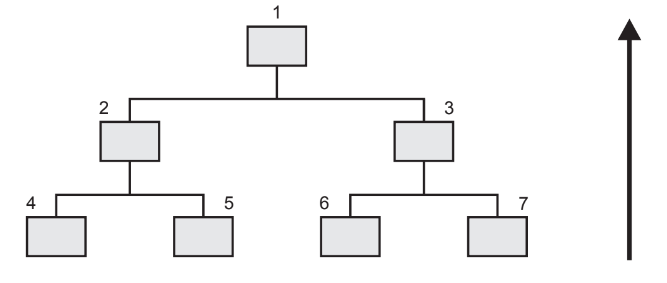

# Unit testing - Kiểm thử đơn vị  
# Integration testing - Kiểm thử tích hợp  
# System testing - Kiểm thử mức hệ thống  
# Acceptance testing - Kiểm thử chấp nhận  

---

---

## Unit testing - Kiểm thử mức đơn vị  

### **Định nghĩa**  
Một đơn vị phần mềm (Unit) là gì? Một Unit là một thành phần phần mềm nhỏ nhất mà ta kiểm tra được.  
Nó bao gồm các các hàm (Function), thủ tục (Procedure), lớp (Class), hoặc các phương thức (Method).  

Kiểm thử đơn vị nhằm đảm bảo rằng code viết cho đơn vị đáp ứng được yêu cầu cụ thể của nó, trước khi tích hợp với các đơn vị khác.  

Ngoài việc kiểm tra sự phù hợp với quy định của chương trình, kiểm thử đơn vị cũng xác minh rằng toàn bộ code đã được viết cho đơn vị có thể thực thi.  

Kiểm thử đơn vị yêu cầu truy cập vào code đang được kiểm tra.  

Một phương pháp tiếp cận kiểm thử đơn vị được gọi là phát triển dựa trên kiểm thử.  
Như tên gọi của nó, trước tiên viết các ca kiểm thử, sau đó xây dựng, kiểm thử và thay đổi code cho đến khi đơn vị vượt qua các kiểm thử.  
Đây là một phương pháp lặp lại cho kiểm thử đơn vị.  

> Unit testing là kiểu white box testing

---

### **Mục đích**  
- Để xác định rằng mỗi đơn vị phần mềm được thực hiện như thiết kế.  
- Thử nghiệm đơn vị làm tăng sự tự tin trong việc thay đổi / bảo trì code.  
- Nếu kiểm tra đơn vị tốt được viết và nếu chúng được chạy mỗi khi bất kỳ code nào được thay đổi,  
  chúng ta sẽ có thể bắt kịp kịp thời mọi lỗi do thay đổi.  
- Chi phí sửa chữa lỗi phát hiện trong khi kiểm tra đơn vị nhỏ hơn so với lỗi phát hiện ở mức cao hơn.  
  So sánh chi phí (thời gian, công sức, sự hỏng hóc, mất thể diện) của một lỗi phát hiện trong quá trình kiểm thử chấp nhận hoặc khi phần mềm đang hoạt động.

---

### **Áp Dụng**  
Sau khi code xong feature **Upload Image** cho **Custom option Image** ngoài **Storefront**, team dev thực hiện viết các unit test với các case:

- Tải lên các ảnh hợp lệ (.png, .jpg,...) thông báo thành công  
- Tải lên các ảnh không hợp lệ (.txt, .pds,...) thông báo lỗi  
- Các unit test đảm bảo các chức năng luôn được hoạt động đúng  
- Unit test cần đảm bảo sau khi sửa code thì các chức năng cũng có thể hoạt động đúng  

---

## Integration Test – Kiểm thử tích hợp  

### **Định nghĩa**  
Là cấp độ kiểm thử phần mềm trong đó các đơn vị riêng lẻ được kết hợp và thử nghiệm dưới dạng một nhóm.  
Một dự án phần mềm bao gồm nhiều module phần mềm, được code bởi nhiều người khác nhau.  
Kiểm thử tích hợp tập trung vào kiểm tra truyền dữ liệu giữa các module  
(tích hợp các hàm lại với nhau, tích hợp các màn hình lại với nhau theo từng module hay dựa theo chức năng.)

---

### **Mục đích**  
- Để lộ các lỗi trong sự tương tác giữa các đơn vị tích hợp.  
- Để tìm ra lỗi trong quá trình tích hợp các thành phần, module lại với nhau.  
- Các trình điều khiển thử nghiệm và các phần tử thử nghiệm được sử dụng để hỗ trợ trong Kiểm thử tích hợp.

---

### **Các phương pháp tiếp cận**  
- **Big bang:** Đây là giai đoạn mà tất cả các đơn vị được liên kết cùng nhau, tạo thành một hệ thống hoàn chỉnh.  
  Khi kiểm thử hệ thống này được tiến hành, rất khó để cô lập bất kỳ lỗi nào được tìm thấy,  
  vì không chú trọng vào việc xác minh các giao diện giữa các đơn vị cá nhân.  
  Loại tích hợp này thường được coi là một lựa chọn tích hợp kém chất lượng.  
  Nó mang lại rủi ro rằng các vấn đề có thể được phát hiện muộn trong dự án, nơi chúng trở nên đắt đỏ hơn để sửa chữa.

- **Top Down:** Hệ thống được xây dựng theo từng giai đoạn, bắt đầu bằng các thành phần gọi các thành phần khác.  
  Các thành phần gọi thành phần khác thường được đặt phía trên so với các thành phần được gọi.  
  Kiểm thử tích hợp từ trên xuống cho phép người kiểm thử đánh giá các giao diện thành phần, bắt đầu từ những giao diện ở "đỉnh".
---

---
- **Button Up:** Trong kiểm thử tích hợp Button Up, các module cấp thấp được tích hợp và kiểm tra trước tiên,  
  tức là kiểm tra từ module phụ đến module chính.  
  Tương tự như Stubs, trình điều khiển ở đây được sử dụng như một module tạm thời để kiểm thử tích hợp.
---

---
- **Sandwich / Hybrid:** Là một cách tiếp cận để kiểm thử tích hợp,  
  đó là sự kết hợp của các phương pháp Top Down và Bottom Up.
> Cần lưu ý rằng việc kiểm thử ở cấp độ tích hợp hệ thống mang theo những yếu tố rủi ro bổ sung.  
> Các yếu tố này có thể bao gồm:  
> - ở mức kỹ thuật: vấn đề liên quan đến đa nền tảng  
> - ở mức hoạt động: vấn đề liên quan đến quy trình kinh doanh  
> - ở mức doanh nghiệp: rủi ro liên quan đến sự sở hữu của các vấn đề hồi quy có thể ảnh hưởng hệ thống khác.

---

### **Áp Dụng**  
Đối với feature **Update custom option image** cần phải làm các chức năng:

- Cho phép buyer preview, chỉnh sửa, điều chỉnh kích thước image upload  
- Bổ sung Button Add to Cart và Guide text vào trong pop up của button live preview  
- Cho phép filter ảnh up lên theo dạng đen trắng  
- Cho phép remove background của ảnh up lên  
- Loại bỏ việc hiển thị full name của image khi upload  
- Update thêm một số tính năng xử lý văn bản tại ô help text  

**Các bước thực hiện kiểm thử tích hợp:**

1. Mỗi chức năng sẽ được gán cho 1 dev để thực hiện code trên máy của mình  
2. Team QE tạo test plan, test design, testcase và automation test cho feature  
3. Sau khi unit test thành công, nhóm dev tích hợp code lại với nhau  
4. Team QE test theo test case và run automation test để tìm lỗi  
5. Dev và QE phối hợp xử lý lỗi  
6. Lặp lại đến khi feature kiểm thử đầy đủ, hoạt động đúng yêu cầu  

---

## System Testing – Kiểm thử mức hệ thống  

### **Định nghĩa**  
Là một mức độ kiểm thử phần mềm, nơi một phần mềm hoàn chỉnh và tích hợp được kiểm tra.  

Điểm khác nhau then chốt giữa Integration Test và System Test là:  
- System Test chú trọng các hành vi và lỗi trên toàn hệ thống  
- Integration Test chú trọng sự giao tiếp giữa các đơn thể hoặc đối tượng khi chúng làm việc cùng nhau  

> Kiểm thử hệ thống bao gồm kiểm thử chức năng và phi chức năng.

---

### **Mục đích**  
- Để đánh giá sự tuân thủ của hệ thống với các yêu cầu được chỉ định  
- Giảm rủi ro do chọn test case không đại diện trong unit/integration  
- Đưa ra đánh giá khách quan về hệ thống dựa trên tài liệu yêu cầu, không phải mã nguồn

---

### **Áp Dụng**  
Sau khi feature **Update custom option image** đã được kiểm thử tích hợp:  
- Trước khi build lên môi trường Production và được User sử dụng → phải test lại toàn bộ hệ thống  
- Giai đoạn này đảm bảo version mới không gây lỗi cho chức năng cũ  
- Team QE thực hiện lại tất cả testcase trong release checklist để đảm bảo toàn vẹn hệ thống

---

## Acceptance Testing - Kiểm thử chấp nhận  

### **Định nghĩa**  
Là một mức độ kiểm thử phần mềm trong đó một hệ thống được kiểm tra tính chấp nhận.  
Được thực hiện bởi người dùng cuối để kiểm tra hệ thống được xây dựng có phù hợp yêu cầu kinh doanh không.  
> Nó còn được gọi là thử nghiệm người dùng doanh nghiệp.

---

### **Mục đích**  
- Đánh giá sự tuân thủ của hệ thống với các yêu cầu kinh doanh  
- Đánh giá hệ thống có được chấp nhận để phân phối hay không  
- Không tập trung tìm lỗi mà xác nhận sự sẵn sàng của hệ thống triển khai

---

### **Các loại kiểm thử chấp nhận**

- **Alpha Testing:** thực hiện tại nơi phát triển phần mềm, độc lập với nhóm phát triển  
- **Beta Testing:** thực hiện tại địa điểm khách hàng, gọi là kiểm thử thực địa

---

### **Áp Dụng**  
Sau khi feature **Update custom option image** được phát triển và kiểm thử đảm bảo:

- Bàn giao cho PM/PO nghiệm thu lại feature  
- PM kiểm tra hoạt động đúng chưa, đúng yêu cầu chưa, phù hợp với khách hàng chưa  
- Nếu có lỗi, yêu cầu update/fix  
- Nếu đạt → thông báo cho người dùng thực tế và nhận feedback để cải tiến
